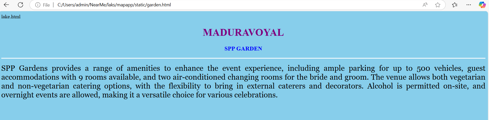

# Ex04 Places Around Me
## Date: 30.4.25

## AIM
To develop a website to display details about the places around my house.

## DESIGN STEPS

### STEP 1
Create a Django admin interface.

### STEP 2
Download your city map from Google.

### STEP 3
Using ```<map>``` tag name the map.

### STEP 4
Create clickable regions in the image using ```<area>``` tag.

### STEP 5
Write HTML programs for all the regions identified.

### STEP 6
Execute the programs and publish them.

## CODE
```
map.html
<!DOCTYPE html>
<html lang="en">
<head>
    <meta charset="UTF-8">
    <meta name="viewport" content="width=device-width, initial-scale=1.0">
    <title>My City</title>
</head>
<body>
 <center>
    <h1 style="color:red">MADURAVOYAL</h1>
    <h3 style="color:red">Mahalakshmi (24900868)</h3>
 </center>   
<!-- Image Map Generated by http://www.image-map.net/ -->


<map name="image-map">
    <area target="" alt="cinema" title="cinema" href="ags.html" coords="1408,767,108" shape="circle">
    <area target="" alt="park" title="park" href="park.html" coords="153,314,126" shape="circle">
    <area target="" alt="palace" title="palace" href="palace.html" coords="870,655,146" shape="circle">
    <area target="" alt="garden" title="garden" href="garden.html" coords="1237,453,107" shape="circle">
    <area target="" alt="hotel" title="hotel" href="hotel.html" coords="1410,98,131" shape="circle">
</map>


</center>
</body>
</html>

palace.html


<html>
<head>
<title>My Home Town</title>
</head>
<body bgcolor="skyblue">
<h1 align="center">
<font color="purple"><b>MADURAVOYAL</b></font>
</h1>
<h3 align="center">
<font color="blue"><b>SRI PADMAVATHI PALACE</b></font>
</h3>
<hr size="3" color="white">
<p align="justify">
<font face="Georgia" size="5">
    Sri Padmavathi Palace is a prominent wedding and event venue located in Vanagaram, Chennai, near Maduravoyal. Renowned for its spacious interiors and elegant design, it caters to a variety of events including weddings, receptions, engagements, and corporate functions
    
</p>
</body>
</html>

garden.html

<html>
<head>
<title>My Home Town</title>
</head>
<body bgcolor="skyblue">
<h1 align="center">
<font color="purple"><b>MADURAVOYAL</b></font>
</h1>
<h3 align="center">
<font color="blue"><b>SPP GARDEN</b></font>
</h3>
<hr size="3" color="white">
<p align="justify">
<font face="Georgia" size="5">
    SPP Gardens provides a range of amenities to enhance the event experience, including ample parking for up to 500 vehicles, guest accommodations with 9 rooms available, and two air-conditioned changing rooms for the bride and groom. The venue allows both vegetarian and non-vegetarian catering options, with the flexibility to bring in external caterers and decorators. Alcohol is permitted on-site, and overnight events are allowed, making it a versatile choice for various celebrations.
    
</p>
</body>
</html>

hotel.html

<html>
<head>
<title>My Home Town</title>
</head>
<body bgcolor="skyblue">
<h1 align="center">
<font color="purple"><b>MADURAVOYAL</b></font>
</h1>
<h3 align="center">
<font color="blue"><b>PUBLIC FOOD SHELTER</b></font>
</h3>
<hr size="3" color="white">
<p align="justify">
<font face="Georgia" size="5">
    In Maduravoyal, public food shelters and hunger-relief efforts are supported through a combination of government initiatives and local charitable organizations. Though there may not be a dedicated public food shelter in the area itself, nearby facilities operated by the Greater Chennai Corporation offer night shelters that often include food for the urban homeless. Nonprofits like Pephands Foundation and Chennai Food Bank regularly distribute meals and groceries to underprivileged communities across the city, including Maduravoyal. Religious institutions such as temples and churches in the area also conduct free meal programs (annadanam) for devotees and those in need. Community kitchens and food distribution drives are occasionally organized by local NGOs, especially during festivals or emergencies. The Tamil Nadu Public Distribution System (PDS) provides subsidized food grains to low-income families through ration cards. Additionally, online directories like GracesList Chennai list nearby free meal services. Volunteers and residents often contribute to these initiatives, ensuring that no one in the community goes hungry.
    
</p>
</body>
</html>

park.html


<html>
<head>
<title>My Home Town</title>
</head>
<body bgcolor="skyblue">
<h1 align="center">
<font color="purple"><b>MADURAVOYAL</b></font>
</h1>
<h3 align="center">
<font color="blue"><b>EXTENSION 5 PARK</b></font>
</h3>
<hr size="3" color="white">
<p align="justify">
<font face="Georgia" size="5">
    ​VGN Mahalakshmi Nagar Extension 5 Park, located in the Vadanoombal area of Maduravoyal, Chennai, is a cherished green space for local residents. This neighborhood park offers a serene environment with well-maintained lawns and shaded walkways, making it an ideal spot for morning and evening walks. Equipped with a children's play area, the park serves as a recreational hub for families, providing a safe and enjoyable space for kids. The presence of benches and seating areas allows visitors to relax and socialize, fostering community interaction. Regular maintenance ensures cleanliness and the upkeep of greenery, contributing to the park's pleasant ambiance. The park's accessibility and open spaces make it suitable for light exercises, yoga sessions, and casual gatherings. Its proximity to residential areas encourages frequent visits by locals seeking a quick retreat into nature. 
    
</p>
</body>
</html>

ags.html


<html>
<head>
<title>My Home Town</title>
</head>
<body bgcolor="skyblue">
<h1 align="center">
<font color="purple"><b>MADURAVOYAL</b></font>
</h1>
<h3 align="center">
<font color="blue"><b>AGS CINEMA</b></font>
</h3>
<hr size="3" color="white">
<p align="justify">
<font face="Georgia" size="5">
    ​AGS Cinemas Maduravoyal is a premier multiplex located at No. 3/47, Alapakkam Main Road, Subramaniapuram, Pallavan Nagar, Chennai, Tamil Nadu 600095 . As the flagship property of AGS Cinemas, it boasts state-of-the-art interiors and top-tier projection technology, including 4K projection and Dolby Atmos sound systems, designed to provide an immersive cinematic experience .
    
</p>
</body>
</html>
```

## OUTPUT




## RESULT
The program for implementing image maps using HTML is executed successfully.
